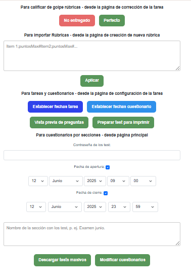

# Facilitador-Docente-Moodle

**Facilitador-Docente-Moodle** es una extensión de Chrome diseñada para automatizar y simplificar tareas comunes de evaluación y configuración en la plataforma Moodle. Especialmente útil para docentes que trabajan con rúbricas, cuestionarios y tareas.

---

## Funcionalidades principales

### Calificación rápida con rúbricas

Permite aplicar de forma automática una calificación a todos los ítems de una rúbrica desde la página de calificación de tareas.

- **Botón `Perfecto`**: Marca todos los niveles más altos de cada criterio.
- **Botón `No entregado`**: Marca el primer nivel de cada criterio y deja el comentario *"No entregado."*
- **Botón `Aplicar rúbrica`**: Inserta una rúbrica completa a partir de un texto CSV con el siguiente formato: 
` "item1";"4"#"item2";"5"#... `

#### Formato de entrada esperado
El contenido se introduce en el campo de texto correspondiente de la extensión, con el siguiente formato:

`"item1";"4"#"item2";"5"#"item3";"6"`

> **Donde:** 
> "itemX" es la descripción del criterio (por ejemplo, "Calidad del código"). 
> 4, 5, 6... son los puntos máximos que puede alcanzar ese criterio. 
> Los ítems están separados entre sí por **#** y cada ítem se compone de dos partes separadas por **;**.

#### Ejemplo de creación de rúbrica:
**Contenido introducido en el campo de texto de la extensión (csv):**

`Funcionamiento correcto del programa;4#Uso adecuado del API criptográfico (generación de clave, encriptación y desencriptación);3#Tratamiento adecuado de excepciones (control de errores durante la encriptación, desencriptación y acceso a fichero);2#Organización y limpieza del código (legibilidad, comentarios, buenas prácticas);1`

**Rúbrica generada:**

---

### Cuestionarios

- **Establecer fechas de cuestionario**: Configura automáticamente las fechas de apertura y cierre.
- **Modificar múltiples cuestionarios**: Aplica fechas y contraseñas a todos los cuestionarios de una sección.
- **Vista previa de preguntas**: Abre en nuevas pestañas todas las URLs de vista previa de cuestionarios disponibles.
- **Preparar test para impresión**: Elimina elementos innecesarios de la página de revisión del intento para facilitar su impresión.
- **Descargar informes de test**: Descarga automáticamente los informes en formato Excel de los cuestionarios de una sección.

---

### Tareas

- **Establecer fechas de entrega y cierre**: Aplica fechas estandarizadas de entrega/cierre en nuevas tareas.

---

## Modo de uso

1. Accede a la plataforma Moodle.
2. Dirígete a la sección o recurso que desees automatizar.
3. Pulsa el botón correspondiente desde la interfaz del plugin.
4. (Opcional) Introduce datos si se requieren (por ejemplo, nombre de la sección o CSV para la rúbrica).

---

## Funciones internas destacadas

### `seleccionarValor(id, valor)`

Selecciona una opción concreta en un `<select>` según su valor numérico.

### `aplicarFecha()`

Establece la fecha actual como fecha de apertura (09:00) y cierre (23:59) de forma automática.

### `setDateAndPassword()`

Realiza una petición `POST` a `modedit.php` para actualizar fechas y contraseña de cuestionarios. Muestra alertas visuales para éxito o fallo.

---

## Seguridad y permisos

Esta extensión utiliza las APIs `chrome.tabs` y `chrome.scripting` para ejecutar código directamente en las páginas activas de Moodle.  
**No recopila, almacena ni transmite datos personales**.

---

## Instalación

1. Clona o descarga este repositorio.
2. Abre `chrome://extensions` en tu navegador.
3. Activa el **modo desarrollador** (arriba a la derecha).
4. Haz clic en **"Cargar sin empaquetar"** y selecciona la carpeta del proyecto.

---

## Requisitos

- Moodle 3.9 o superior.
- Permisos de edición o calificación en el curso correspondiente.

---

## Licencia

MIT © Facilitador-Docente-Moodle

---

## Conclusión

Esta herramienta permite a los docentes ahorrar tiempo en tareas repetitivas como calificar con rúbricas, gestionar fechas y configurar múltiples cuestionarios. Su diseño modular permite futuras ampliaciones como automatización de bancos de preguntas o asistencia en revisión por pares.

---

# Captura de pantalla del plugin

